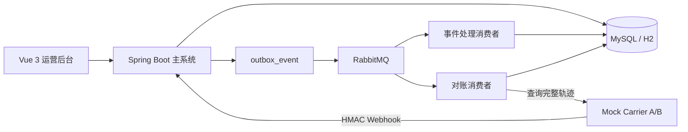

# TrackFlow 多物流商履约事件治理平台

TrackFlow 是一个面向电商、ERP、客服和售后系统的物流履约事件治理平台。它重点解决多家物流商 Webhook 格式不一致、重复推送、乱序到达、漏推事件、状态冲突和主动对账补偿等问题。

这个项目不是普通 CRUD 后台，而是围绕“事件可靠处理”设计的全栈项目：系统会保留原始事件，转换成统一事件，按业务发生时间重放状态机，并在异常场景下留下可追溯证据。

## 适合面试讲的亮点

- 事件驱动建模：区分 `eventTime` 和 `receivedTime`，避免“最后收到的事件覆盖真实状态”。
- 幂等设计：通过 `carrier_id + idempotency_key` 和 `carrier_id + event_fingerprint` 做数据库兜底，重复 Webhook 返回成功但不重复写业务数据。
- Outbox 可靠消息：Webhook 入库和 Outbox 事件在同一事务内完成，再由定时发布器投递 RabbitMQ。
- 手动 ACK 消费：消费者先抢占数据库任务，再处理事件；失败进入有限重试，终态失败可进入 DLQ。
- 状态机重放：按 `eventTime -> receivedTime -> id` 排序重放，支持乱序事件和迟到事件。
- 异常治理：UNKNOWN 状态、非法状态流转、对账差异都会形成可追踪记录。
- 主动对账补偿：漏推场景下通过物流商查询接口拿完整轨迹，补入 `RECONCILIATION` 来源事件并重建运单状态。
- 可演示 Mock 服务：内置 MOCK_A / MOCK_B 两个物流商，字段、时间格式、状态码不同，支持重复推送、乱序、漏推、查询超时和查询 500。
- 前后端分离交付：Spring Boot 后端、Vue 运营台、Mock Carrier、Flyway、Docker Compose、测试和本地验证脚本完整保留。

## 系统架构



## 核心链路

### Webhook 异步处理

1. 物流商推送 Webhook，系统校验 HMAC、时间戳和物流商身份。
2. 原始报文写入 `raw_carrier_event`，处理任务写入 `event_process_task`。
3. 同一事务写入 `outbox_event`，HTTP 立即返回 `202 Accepted`。
4. Outbox Publisher 发布 RabbitMQ 消息，并等待 publisher confirm。
5. 消费者手动 ACK，抢占任务、标准化事件、重放状态机、生成异常。

### 主动对账补偿

1. 用户在运单详情发起对账。
2. 后端创建 `reconciliation_batch`、`reconciliation_task` 和 Outbox 事件。
3. 对账消费者异步查询 Mock Carrier 完整轨迹。
4. 系统按指纹比对缺失事件，只补入数据库中没有的物流事件。
5. 补偿事件来源标记为 `RECONCILIATION`，随后重放运单状态。

## 技术栈

- 后端：Java 17、Spring Boot 3、Spring MVC、Validation、JDBC、Flyway、Spring AMQP、Actuator、springdoc-openapi
- 前端：Vue 3、TypeScript、Vite、Element Plus、Axios、Vitest、Playwright
- 基础设施：Docker Compose、MySQL 8、RabbitMQ、Nginx
- 测试：JUnit 5、AssertJ、H2 MySQL Mode、Vitest、Playwright

## 端口

- 前端：http://127.0.0.1:8001
- 主系统 API：http://127.0.0.1:8002
- Swagger：http://127.0.0.1:8002/swagger-ui/index.html
- Mock Carrier：http://127.0.0.1:8003
- MySQL 宿主机端口：3307
- RabbitMQ 管理台：http://127.0.0.1:15672

## 本地启动

```powershell
cd C:\Users\23180\Desktop\新建文件夹\trackflow-platform

# 后端主系统
.\mvnw.cmd -pl server spring-boot:run

# Mock 物流商
.\mvnw.cmd -pl mock-carrier spring-boot:run

# 前端
cd web
npm ci
npm run dev
```

也可以使用 Docker Compose 启动依赖服务：

```powershell
docker compose up -d mysql rabbitmq
```

## 测试与构建

```powershell
.\mvnw.cmd test
.\mvnw.cmd package -DskipTests

cd web
npm run test
npm run build

cd ..
docker compose config
```

当前已验证：

- 后端测试通过：11 个测试，覆盖状态机、签名工具、Flyway 迁移、Webhook Outbox、乱序重放、异步对账入队。
- 前端单测通过：状态文案和时间格式化。
- 前端生产构建通过。
- Docker Compose 配置校验通过。

说明：当前机器 Docker Desktop daemon 未运行，因此 MySQL / RabbitMQ 容器实机验证、Testcontainers 和完整 Compose 启动仍需在 Docker 可用后执行。

## 演示路径

1. 打开前端 `http://127.0.0.1:8001` 查看数据概览。
2. 进入“故障模拟”，选择 `DUPLICATE_PUSH`、`OUT_OF_ORDER` 或 `MISSING_EVENT`。
3. 在“运单管理”查看最终可信状态和事件时间线。
4. 在“原始事件”查看签名校验、处理状态和重复推送。
5. 在“处理任务”查看异步事件任务、重试次数和失败原因。
6. 对漏推运单发起“对账”，再到“对账任务”查看异步补偿任务。

## 目录结构

```text
trackflow-platform/
├── server/          # Spring Boot 主系统
├── mock-carrier/    # Mock 物流商服务
├── web/             # Vue 3 运营后台
├── docs/            # 架构、接口、数据库、测试和审计文档
├── scripts/         # 本地启动和验证脚本
├── docker-compose.yml
└── README.md
```

## 真实限制

- 当前仍是模块化单体，不是微服务拆分；这样更适合实习面试演示核心后端能力。
- 持久层使用 Spring JDBC，避免为了“堆框架”引入过多样板代码。
- RabbitMQ 拓扑、Outbox、消费者、ACK、重试和 DLQ 路由已经实现，但当前环境还没有 Docker daemon，无法完成 RabbitMQ 实机验证。
- 后续可以继续补 Testcontainers、WireMock、并发压测和更完整的 CI。
