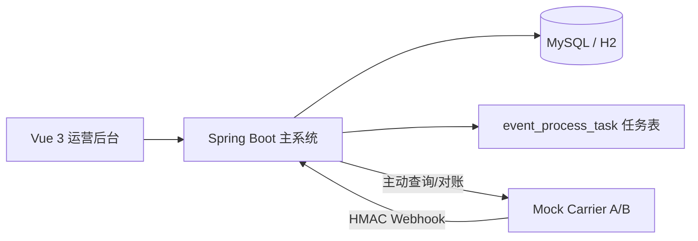
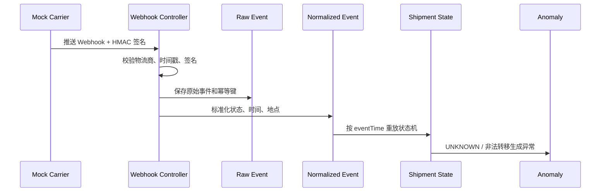

# TrackFlow 多物流商履约事件治理平台

TrackFlow 是一个面向电商、ERP、客服和售后系统的物流履约事件治理平台。项目重点解决多家物流商 Webhook 格式不一致、重复推送、乱序到达、漏推事件、状态冲突和主动对账补偿等问题。

这个项目不是普通 CRUD 后台，而是围绕“事件可靠处理”设计：系统会保留原始事件，转换为统一事件，按业务发生时间重放状态机，并在异常场景下留下可追溯证据。

## 适合面试讲的亮点

- **事件驱动建模**：区分 `eventTime` 和 `receivedTime`，避免“最后收到的事件覆盖真实状态”。
- **幂等设计**：通过 `carrier_id + idempotency_key` 数据库唯一约束兜底，重复 Webhook 返回成功但不重复写业务数据。
- **状态机重建**：按 `eventTime -> receivedTime -> id` 排序重放事件，防止乱序推送造成状态回退。
- **异常治理**：UNKNOWN 状态、非法流转、长时间未更新等会生成异常记录，而不是静默丢弃。
- **主动对账补偿**：Webhook 漏推后，系统可通过对账补入 `RECONCILIATION` 事件并重建运单状态。
- **可演示 Mock 服务**：内置两个物流商，字段格式、时间格式、状态码都不同，便于现场演示。
- **工程化交付**：包含前端、后端、Mock 服务、Flyway、Docker Compose、测试、README 和面试讲解文档。

## 系统架构



## 核心流程



## 技术栈

- 后端：Java 17、Spring Boot 3、Spring MVC、Validation、JDBC、Flyway、Actuator、springdoc-openapi
- Mock 服务：Java 17、Spring Boot 3
- 前端：Vue 3、TypeScript、Vite、Pinia、Axios、Element Plus、Vitest
- 部署：Docker Compose、MySQL 8、RabbitMQ、Nginx

> 当前开发环境使用 Java 17。Spring Boot 3 支持 Java 17+，因此项目按 Java 17 构建和验证。

## 端口

- 前端：http://127.0.0.1:8001
- 主系统：http://127.0.0.1:8002
- Swagger：http://127.0.0.1:8002/swagger-ui/index.html
- Mock 物流商：http://127.0.0.1:8003
- MySQL 宿主端口：3307，容器内部仍为 3306
- RabbitMQ 管理台：http://127.0.0.1:15672

## 本地启动

```powershell
cd C:\Users\23180\Desktop\新建文件夹\trackflow-platform
mvn -pl server spring-boot:run
mvn -pl mock-carrier spring-boot:run
cd web
npm ci
npm run dev
```

## 测试与构建

```powershell
mvn test
cd web
npm ci
npm run type-check
npm run test
npm run build
docker compose config
```

已实际验证：

- 后端测试通过：状态机、签名工具
- 前端测试通过：状态标签、时间格式工具
- 前端类型检查和生产构建通过
- Docker Compose 配置校验通过
- 本地端到端场景通过：重复推送 9 次，其中 3 次识别为重复，最终状态仍为 `DELIVERED`

## 演示路径

1. 打开前端 `http://127.0.0.1:8001` 查看数据概览。
2. 进入“故障模拟”，选择 `DUPLICATE_PUSH` 或 `OUT_OF_ORDER`。
3. 执行后进入“运单管理”，查看最终状态和事件时间线。
4. 在“原始事件”查看签名校验、处理状态和重复事件。
5. 对异常运单发起主动对账，观察补入事件和状态重建。

## 目录结构

```text
trackflow-platform/
├── server/          # Spring Boot 主系统
├── mock-carrier/    # Mock 物流商服务
├── web/             # Vue 3 运营后台
├── docs/            # 架构、数据库、测试、演示和面试文档
├── scripts/         # 本地启动和验证脚本
├── docker-compose.yml
└── README.md
```

## 真实限制

- 当前实现使用 Spring JDBC，没有引入 MyBatis，目的是让项目更轻、便于本地稳定演示。
- RabbitMQ 和 Compose 已配置；本地演示默认使用数据库任务表和扫描器完成任务恢复。
- 测试覆盖了核心算法和工具函数，但还可以继续补 Testcontainers、WireMock 和更完整的并发集成测试。

更多面试讲解见：[docs/interview-guide.md](docs/interview-guide.md)。
